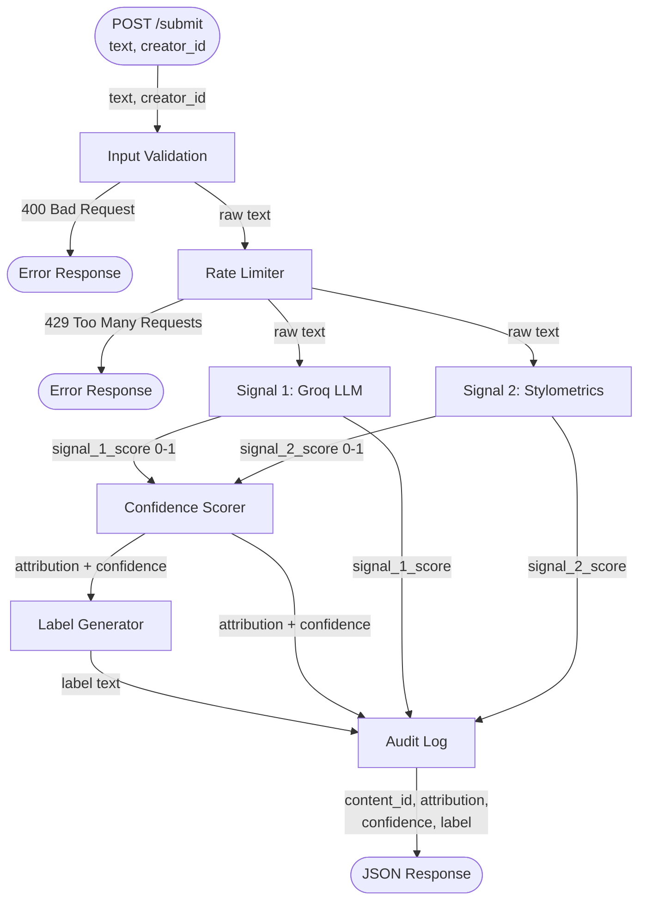
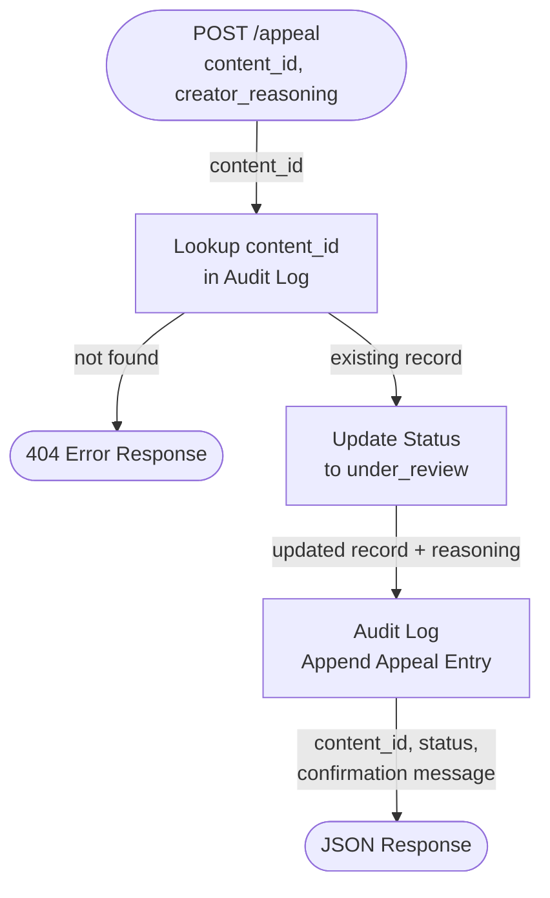

# Provenance Guard — Planning Document

## Artifact 1 — Architecture Narrative

A single piece of text takes the following path through the system, from submission to the label a reader sees:

1. **`POST /submit`** — The creator sends a JSON body containing `text` and `creator_id`. This is the entry point to the entire pipeline.

2. **Input Validation** — Flask checks that `text` is present and non-empty. If validation fails, the request is rejected immediately with a `400` error before any signal processing occurs.

3. **Rate Limiter** — Flask-Limiter checks whether this client has exceeded the configured request limit. If the limit is exceeded, the request is rejected with a `429` response. No signal processing, no log entry.

4. **Signal 1 — Groq LLM (`llama-3.3-70b-versatile`)** — The raw text is sent to the Groq API with a structured prompt asking the model to assess whether the text reads as AI-generated or human-written. The model returns a `signal_1_score` between 0.0 and 1.0, where 1.0 means the model is highly confident the text is AI-generated.

5. **Signal 2 — Stylometric Heuristics (pure Python)** — The same raw text is analyzed locally. The function computes sentence-length variance, type-token ratio (unique words ÷ total words), and punctuation density, then combines these into a single `signal_2_score` between 0.0 and 1.0, where 1.0 means the text is statistically very uniform (AI-like).

6. **Confidence Scorer** — Both signal scores are combined (weighted average) into a single `confidence` value (0.0–1.0). Confidence here measures *how certain the system is of its verdict*, not which direction the verdict goes. Confidence is highest when both signals strongly agree; lowest when they conflict or both sit near the midpoint.

7. **Label Generator** — The `attribution` direction (`likely_ai`, `likely_human`, or `uncertain`) is determined by where the signals point and how much they agree. The label generator then maps `attribution` + `confidence` to one of three transparency label texts for display to the reader.

8. **Audit Log** — Before returning the response, a structured entry is written to the audit log with the following fields:

   | Field | Description |
   |---|---|
   | `content_id` | UUID generated at submission time |
   | `creator_id` | Passed in from the request |
   | `timestamp` | ISO 8601 UTC |
   | `signal_1_score` | Raw Groq LLM score (0.0–1.0) |
   | `signal_2_score` | Raw stylometric score (0.0–1.0) |
   | `attribution` | `likely_ai` / `likely_human` / `uncertain` |
   | `confidence` | Combined certainty score (0.0–1.0) |
   | `label` | The exact label text shown to the reader |
   | `status` | `classified` on initial decision; `under_review` after appeal |

9. **JSON Response** — Flask returns the structured response to the caller: `content_id`, `attribution`, `confidence`, and `label`.

---

## Artifact 2 — Two Detection Signals

### Signal 1 — Groq LLM Classifier

**(a) What it measures:**
Semantic and stylistic coherence holistically — does this text *feel* AI-generated? The model picks up on balanced sentence structure, hedging language ("it is important to note that…"), lack of genuine personal voice, and overly consistent tone throughout the piece.

**(b) Why this property differs between human and AI writing:**
AI models are trained to produce safe, well-structured, consistently-toned output. Human writing carries idiosyncratic word choices, emotional inconsistency, tangents, and an uneven rhythm that reflects a real person's thought process. An LLM evaluator can detect the absence of those irregularities even when it cannot articulate exactly why.

**(c) Blind spots:**
- A skilled human deliberately writing in a formal, structured style will fool it.
- A heavily edited AI draft that had the rough edges added back in will score low.
- It is expensive per-call and adds latency to every request.
- It captures nothing about the statistical *structure* of the text — only its meaning and style holistically.

---

### Signal 2 — Stylometric Heuristics (Pure Python)

**(a) What it measures:**
Statistical structural patterns computed directly from the text: sentence-length variance (how much sentence lengths vary from the mean), type-token ratio (unique words ÷ total words, a measure of vocabulary diversity), and punctuation density (punctuation marks ÷ total characters).

**(b) Why these properties differ between human and AI writing:**
AI text is statistically uniform — sentence lengths cluster around a predictable range, vocabulary spread is consistent, and punctuation follows standard patterns. Human writing is messier: sentence lengths jump around, vocabulary repeats or surprises unpredictably, and punctuation reflects personal style (em dashes, ellipses, missing commas). High uniformity → high AI-likeness score.

**(c) Blind spots:**
- Formal or academic human writing (legal documents, scientific papers) is structurally uniform and looks AI-like to this signal.
- Short texts (fewer than ~5 sentences) do not provide enough data for reliable statistics — variance estimates are noisy.
- It is completely blind to meaning — it cannot tell the difference between a bureaucratic human memo and an AI essay if their statistical profiles match.

---

**Why these two signals are distinct:** Signal 1 is **semantic** (meaning and style) and Signal 2 is **structural** (statistical patterns). Each covers the other's primary blind spot — a formal human text that fools Signal 2 on structure will likely not fool Signal 1 on voice, and vice versa. This independence is the core justification for multi-signal detection.

---

## Artifact 3 — False-Positive Trace

**Scenario:** A non-native English speaker submits a formal poem with simple, repetitive vocabulary and uniform sentence structure.

- **Signal 2** scores it high on AI-likeness: sentence lengths are uniform, vocabulary diversity (type-token ratio) is low due to repetition, and the structure is tidy. `signal_2_score ≈ 0.72`.
- **Signal 1** scores it moderately: the phrasing is formal and lacks conversational irregularity, but the LLM may detect something personally expressive in the imagery. `signal_1_score ≈ 0.58`.
- The signals partially conflict and both sit in the mid-range. The confidence scorer recognizes this disagreement and returns a low confidence value. The direction is not clearly AI or clearly human.
- Result: `attribution: uncertain`, `confidence ≈ 0.55`. The system does **not** return `likely_ai`.
- The label shown to the reader is the **uncertain variant** — cautious, non-accusatory language that communicates "our system is not sure" rather than "this looks AI-generated."
- The creator sees the label, disagrees, and sends `POST /appeal` with their `content_id` and a written explanation ("I am a non-native English speaker and my writing style may appear more formal than typical").
- The system flips `status` to `under_review`, logs the appeal alongside the original classification entry, and returns a confirmation.

**Design decision this forces for Milestone 2:** The "uncertain" verdict must be the *default landing zone* for ambiguous cases — not a rare edge case. This means the uncertain band must be **wide** (e.g. roughly 0.35–0.70 on the confidence axis), so that the system requires genuinely strong, consistent signal agreement before committing to a `likely_ai` verdict. A narrow uncertain band (e.g. 0.45–0.55) would push borderline cases into accusations, which is worse than a false negative on a writing platform. The exact threshold numbers are an open decision for Milestone 2; this trace is the reason the band must lean wide and cautious.

---

## Artifact 4 — API Surface

| Endpoint | Method | Accepts | Returns |
|----------|--------|---------|---------|
| `/submit` | POST | `text`, `creator_id` | `content_id`, `attribution` (`likely_ai` \| `likely_human` \| `uncertain`), `confidence` (float 0.0–1.0), `label` (string) |
| `/appeal` | POST | `content_id`, `creator_reasoning` | `content_id`, `status: "under_review"`, `message` (confirmation string) |
| `/log` | GET | nothing (optional `?limit=N`) | `{ "entries": [...] }` — array of structured audit log entries |

**Note:** `content_id` is the binding thread of the entire system. It is generated by `/submit`, returned in the response, required by `/appeal` to locate the original decision, and recorded in every audit log entry. Without it, the appeal workflow has nothing to look up and the audit log cannot link decisions to appeals.

---

## Architecture

### Submission Flow



---

### Appeal Flow


---

## Milestone 1 Checkpoint

- [x] Full path of a submitted piece of text named end-to-end, every component listed in order
- [x] Two detection signals defined, each with what it measures, why it differs, and its blind spot
- [x] Three API endpoints listed with inputs and outputs
- [x] Submission flow diagrammed with labeled arrows
- [x] Appeal flow diagrammed with labeled arrows

---

## MS2 — Spec

### Detection Signals

**Signal 1 — Groq LLM (`llama-3.3-70b-versatile`)**
- **Output:** `signal_1_score` — float 0.0–1.0, where 1.0 = highly AI-like
- **How:** Send the text to the Groq API with a structured prompt instructing the model to return a single numeric score assessing AI-likeness. Parse the number from the response.
- **Convention:** 1.0 = most AI-like, 0.0 = most human-like (consistent across both signals)

**Signal 2 — Stylometric Heuristics (pure Python)**
- **Output:** `signal_2_score` — float 0.0–1.0, where 1.0 = most AI-like (statistically uniform)
- **How:** Compute three sub-metrics, normalize each to 0.0–1.0 with 1.0 = AI direction, then average:
  - **Sentence-length variance:** Low variance = AI-like (uniform sentence lengths). `sub_score = 1 − normalized_variance`
  - **Type-token ratio:** Low diversity = AI-like (high uniformity). `sub_score = 1 − type_token_ratio` (high TTR = diverse = human)
  - **Punctuation density:** Low density = AI-like (clean, minimal punctuation; human writing tends toward stylistic punctuation — em dashes, ellipses, informal omissions). `sub_score = 1 − normalized_punctuation_density`
- `signal_2_score = mean(sentence_variance_score, ttr_score, punctuation_score)`
- **Sub-metric reliability note:** Sentence-length variance is the dominant sub-metric. TTR is the weakest: for texts under ~80 words, TTR saturates toward 1.0 regardless of authorship (most words are unique in a short passage), meaning it can mildly mis-vote on short AI text (scoring it slightly human-like). TTR is retained per spec but contributes limited differentiation on typical short submissions; sentence-length variance carries most of the signal.

**Combination formula:**
```
raw_score = (0.60 × signal_1_score) + (0.40 × signal_2_score)
```
LLM weighted higher (0.60) because it captures semantic meaning; stylometrics (0.40) is cheaper but structurally blind to meaning.

**Deriving attribution and confidence:**
```
confidence = 0.5 + |raw_score − 0.5|

if raw_score >= 0.70   → attribution = likely_ai
elif raw_score <= 0.30 → attribution = likely_human
else                   → attribution = uncertain
```
Boundaries are inclusive toward the confident verdicts (≥0.70 → AI, ≤0.30 → human); everything strictly between (0.30 < raw_score < 0.70) is uncertain.

---

### Uncertainty Representation

Confidence measures *how certain the system is of its verdict*, not the direction. ~0.50 = genuine uncertainty (signals conflict or both sit near the midpoint). ~0.95 = near-certain (both signals strongly agree). The same high confidence value can appear for a strong AI verdict or a strong human verdict.

| raw_score range | attribution | confidence range |
|---|---|---|
| 0.70 – 1.00 | `likely_ai` | 0.70 – 1.00 |
| 0.30 < raw < 0.70 | `uncertain` | 0.50 – 0.70 (exclusive at top) |
| 0.00 – 0.30 | `likely_human` | 0.70 – 1.00 |

**Worked example:**
- `raw_score = 0.62` → `attribution = uncertain`, `confidence = 0.5 + |0.62 − 0.5| = 0.62` → creator sees the Uncertain label ("mixed or inconclusive, not an accusation"). No confidence number shown on the label.
- `raw_score = 0.93` → `attribution = likely_ai`, `confidence = 0.93` → creator sees the AI label with confidence displayed.

---

### Transparency Label Design

Labels are selected by **`attribution` alone** — no confidence gate. This guarantees all three variants are always reachable and eliminates dead zones.

**High-confidence AI** (`attribution == likely_ai`):
> "This content shows strong signals of AI generation. Our automated analysis found the writing style and structure consistent with AI-generated text (confidence: {confidence:.0%}). If you are the creator and believe this is incorrect, you can submit an appeal."

**High-confidence Human** (`attribution == likely_human`):
> "This content shows strong signals of human authorship. Our analysis found the writing style, structure, and patterns consistent with human-written work (confidence: {confidence:.0%})."

**Uncertain** (`attribution == uncertain`):
> "Our system could not confidently determine whether this content was written by a human or generated by AI. The signals were mixed or inconclusive. This label reflects genuine uncertainty — not an accusation. If you are the creator, you may submit an appeal to add context."

The confidence number is shown inside the AI and Human label texts. It is intentionally omitted from the Uncertain label — displaying a number on an uncertain verdict ("62% confident I'm not sure") is confusing to a non-technical user. The raw value is still stored in the audit log.

---

### Appeals Workflow

**Who can submit:** Any creator who holds a `content_id` from a `/submit` response.

**What they provide:** `content_id` + `creator_reasoning` (free-text, no length limit).

**What the system does:**
1. Looks up `content_id` in the audit log → returns 404 if not found
2. Updates `status`: `classified` → `under_review`
3. Appends an appeal entry to the audit log: `content_id`, `timestamp`, `creator_reasoning`, `original_attribution`, `original_confidence`
4. Returns: `{ "content_id": "...", "status": "under_review", "message": "Your appeal has been received and is under review." }`

No automated re-classification. A human reviewer reads the queue.

**What a reviewer sees in `GET /log`:**
- Original decision entry: attribution, confidence, both signal scores, timestamp
- Appeal entry alongside it: creator's reasoning, timestamp of appeal
- `status: under_review` on the record

---

### Anticipated Edge Cases

**Edge case 1 — Technical human writing (tutorial / documentation):**
A software developer writes a detailed technical walkthrough: formal register, consistent sentence structure, precise vocabulary, no slang. Signal 2 scores it high AI-likeness (uniform structure, low punctuation density). Signal 1 may also score it high (well-organized, no personal tangents). The system risks returning `likely_ai` for a fully human piece. This is the most dangerous false positive — technical writers are a core platform demographic.

**Edge case 2 — Very short text (haiku, one-paragraph excerpt):**
Fewer than 4–5 sentences means Signal 2's variance calculations are statistically unreliable — you cannot compute meaningful variance from 3 data points. The stylometric score becomes noise. The system effectively runs on Signal 1 alone, which violates the multi-signal principle. Short texts should default to a wider uncertain band or surface a low-data warning.

---

## Architecture

A submitted piece of text enters at `POST /submit`, passes through input validation and rate limiting, then flows in parallel through Signal 1 (Groq LLM) and Signal 2 (stylometric heuristics). Both scores feed the confidence scorer, which produces `attribution` and `confidence`. The label generator selects the correct label text based on `attribution` alone, and the full result is written to the audit log before the JSON response is returned.

Appeals enter at `POST /appeal`, look up the original decision by `content_id`, flip the status to `under_review`, and append an appeal entry to the audit log alongside the original record.

### Submission Flow


### Appeal Flow



---

## AI Tool Plan

### M3 — Submission Endpoint + Signal 1

**Provide to AI tool:** Detection Signals section (Signal 1 only) + Architecture narrative + Submission Flow diagram

**Ask for:**
1. Flask app skeleton with `POST /submit` route stub and `GET /log` stub
2. `get_llm_score(text) → float` function that calls Groq with a structured prompt and returns a single 0.0–1.0 score

**Verify before wiring:**
- Call `get_llm_score()` directly on 3 test texts (clearly AI, clearly human, borderline)
- Confirm the raw float is in 0.0–1.0 range and moves in the expected direction
- Only wire into `/submit` after standalone verification passes

### M4 — Signal 2 + Confidence Scoring

**Provide to AI tool:** Detection Signals section (both signals, sub-metric directions explicit) + Uncertainty Representation section + Submission Flow diagram

**Ask for:**
1. `get_stylometric_score(text) → float` implementing the three sub-metrics with correct AI directions
2. `compute_attribution_and_confidence(s1, s2) → (attribution, confidence)` implementing the weighted average and threshold logic

**Verify:**
- Run all 4 assignment sample texts through both signals separately, print both scores
- Check combined output against the threshold table — clearly AI text should produce `likely_ai`, clearly human should produce `likely_human`
- If any sample produces a counter-intuitive result, print both signal scores separately to isolate which signal is misbehaving

### M5 — Production Layer

**Provide to AI tool:** Transparency Label Design section + Appeals Workflow section + both flow diagrams

**Ask for:**
1. `generate_label(attribution, confidence) → str` returning the correct label text per the spec
2. `POST /appeal` endpoint implementing lookup → status update → audit log append → confirmation

**Verify:**
- Submit 3 texts that produce different `attribution` values — confirm all 3 label variants are returned
- Submit an appeal using a real `content_id` from a prior `/submit` response
- Call `GET /log` and confirm the entry shows `status: under_review` and `creator_reasoning` populated

---

## Milestone 2 Checkpoint

- [x] All five MS2 questions answered with specific, implementation-ready values
- [x] Three label variants written out verbatim; each reachable by attribution alone
- [x] Confidence scoring produces different labels at different score ranges — no binary flip at 0.5
- [x] `## Architecture` section present with both flow diagrams from Milestone 1
- [x] `## AI Tool Plan` covers M3/M4/M5 with specific sections, requests, and verification steps
